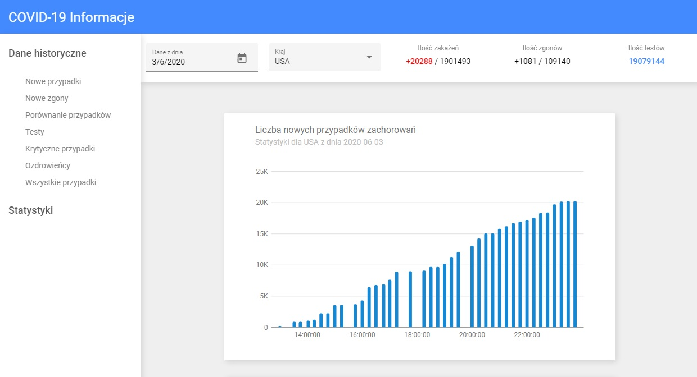

# Covid-19-Stats

## Table of contents

* [General info](#general-info)
* [Technologies](#technologies)
* [ToDo](#todo)

## General info

This app uses free API and allows you to find information and statistics about COVID-19. You can select the date and country and check how many cases, deaths, infected were there, and sort the data in the statistics table.

## Technologies

* Angular v9.1.12
* CSS
* HTML

## ToDo

Update charts for other countries and days.

## Demo

https://stats-cov-19.netlify.app/

